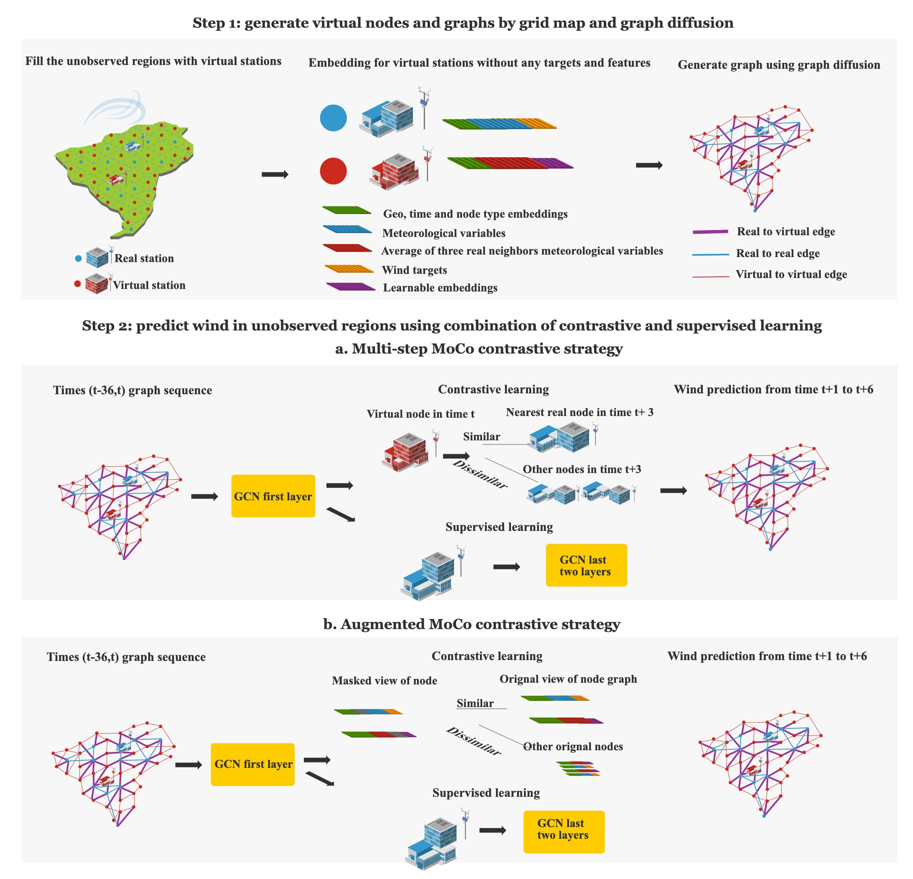
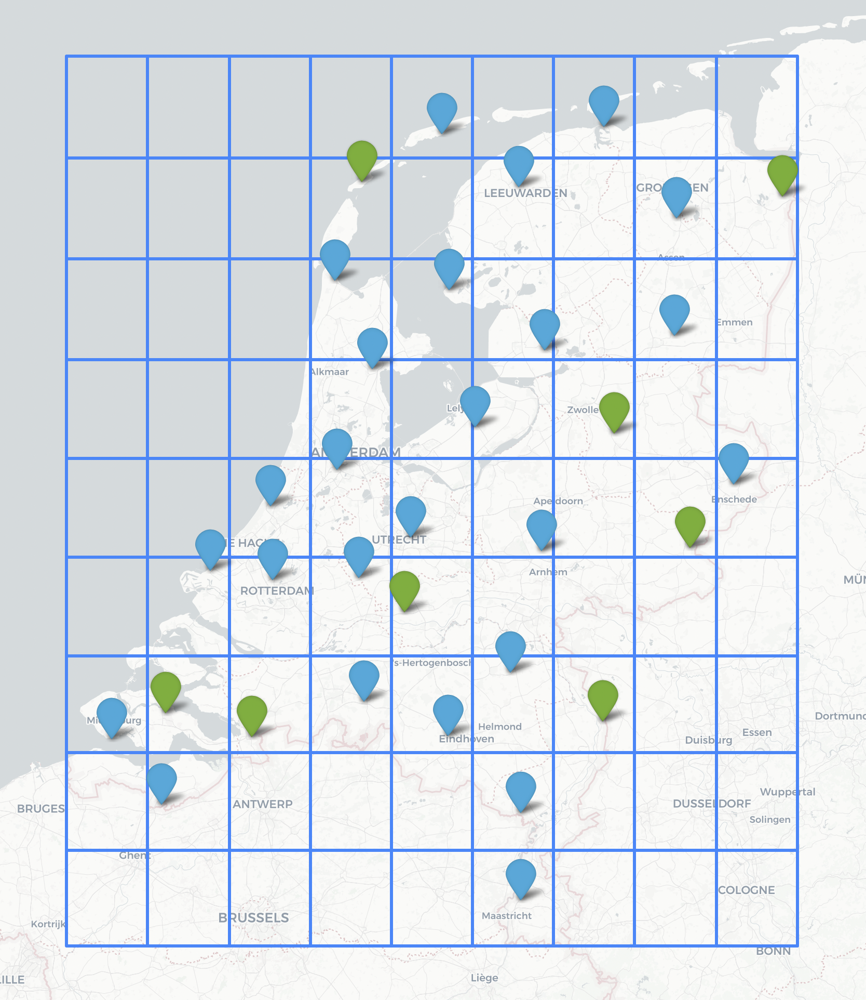

#  ContraVirt: Wind Nowcasting in Unobserved Regions

##  Introduction
**ContraVirt** is a framework for **wind forecasting in regions without meteorological stations**.  
It integrates **real stations** with **virtual nodes** (representing unobserved locations) and combines **graph diffusion**, **contrastive learning**, and **multi-step forecasting**.

**The virtual and real station map** more info see the paper and info/station_info.csv
<p align="center">
  
  
  
</p>
---

##  Installation
```bash
git clone https://github.com/JieJieNiu/-Wind-Nowcasting-in-Unobserved-Regions.git
pip install -r requirements.txt
```
---


## 📂 Project Structure
```
.
├── info/ 
│   └── station_info.csv   # Metadata of weather stations
├── creat_virtual_nodes.py #creat grid and virtual nodes
├── GDC_data.py  # creat diffusion graph
├── cache_diffused_graphs.py #diffusion graph data save to path
├── CL_loss.py  #contrastive loss
├── model.py     # ContraVirt model     
├── train.py          # Training script
├── test.py                # test script, save to prediction results to the path
├── args.py                
├── evaluation.py       # evaluate models prediction from test.py with ground truth
└── README.md              # Project documentation
└──requirements.txt            

```
---

##  Usage

### 1. Preprocess dataset
```bash
python cache_diffused_graphs.py --data_dir ./data --args.args.DIFFUSION_METHOD="ppr"
```

### 2. Train a model
```bash
python train_loop.py --model Multi_step_MoCo --args.enable_multi_step_moco = True --epochs 200 --batch_size 32
python train_loop.py --model Augmented_MoCo --args.enable_augmented_moco = True --epochs 200 --batch_size 32
python train_loop.py --model Multi_step --args.enable_multi_step = True --epochs 200 --batch_size 32
python train_loop.py --model Augmented --args.enable_augmented = True --epochs 200 --batch_size 32
python train_loop.py --model w/o contrastive --args.enable_contrastive = False --epochs 200 --batch_size 32
python train_loop.py --model w/o contrastive&diffusion --args.DIFFUSION_METHOD="raw" --args.enable_contrastive = False --epochs 200 --batch_size 32
```

### 3. Prediction on test stations
```bash
python test.py --model Multi_step_MoCo
python test.py --args.MODEL_NAME Augmented_MoCo 
python test.py --args.MODEL_NAME Multi_step 
python test.py --args.MODEL_NAME Augmented
python test.py --args.MODEL_NAME w/o contrastive
python test.py --args.MODEL_NAME w/o contrastive&diffusion
```

---

##  Evaluation
- **Stations**: 8 held-out stations (not used in training)  
- **Metrics**:  
  - MAE / RMSE for wind speed (ff) and wind gust (gff)  
  - Angular MAE / RMSE for wind direction (dd) 
```bash
python evaluate.py
```
---
## Results
<p align="center">
  
  
</p>

<p align="center">
  
</p>


## 📜 Citation
If you use this code, please cite:
```bibtex

```

---

